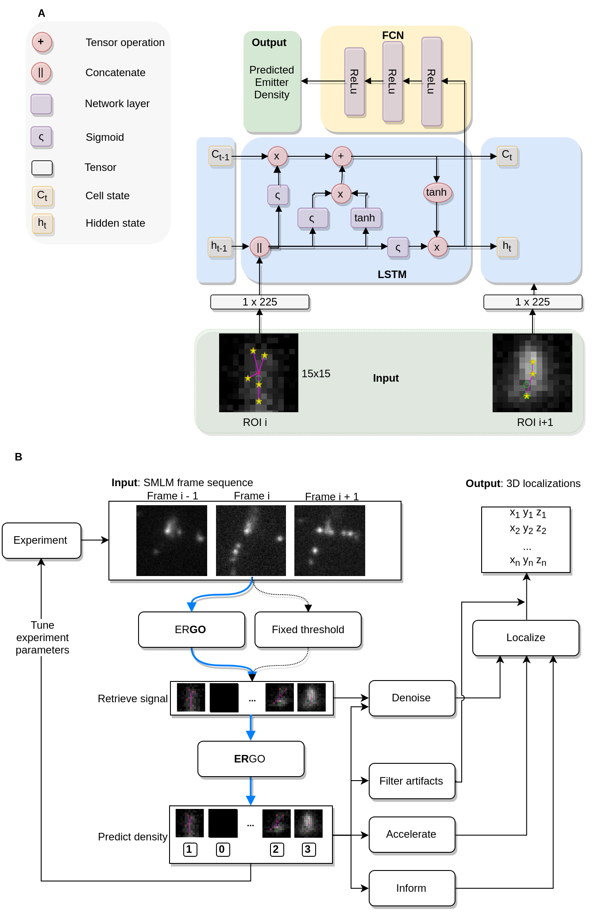

# ERGO: Efficient Recurrent Graph Optimized Emitter Density Estimation in Single Molecule Localization Microscopy

This repository holds the source accompanying our [IEEE Transactions in Medical Imaging 2020 paper](http://www.cs.sfu.ca/~hamarneh/ecopy/tmi2020.pdf).

This project has 2 stages:
- Localization : ERGO.jl https://github.com/bencardoen/ERGO.jl
- Counting/Density estimation : ERGO.py https://github.com/bencardoen/ERGO.py

All files in this repository are licensed under [**Affero GPL v 3**](https://www.gnu.org/licenses/agpl-3.0.txt), copyright 2018-2021 Ben Cardoen.

The software was developed in a multidisciplinary collaboration between the labs of [Prof. Ghassan Hamarneh](https://www.medicalimageanalysis.com/ghassans-bio), [Prof. Ivan Robert Nabi](https://www.bme.ubc.ca/person/ivan-nabi/), and [Prof. Keng C. Chou](https://www.chem.ubc.ca/keng-chou). This project could not have been realized without my other co-authors: Hanene Ben Yedder, and Anmol Sharma.

#### Manuscript :
http://www.cs.sfu.ca/~hamarneh/ecopy/tmi2020.pdf
